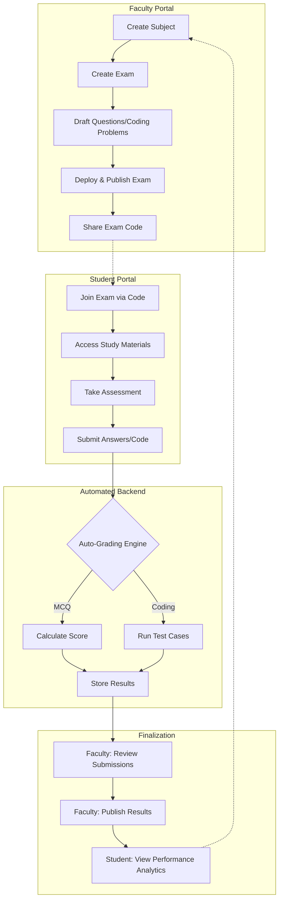
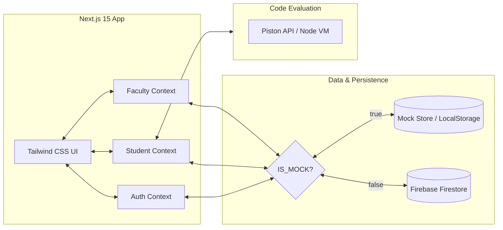

# AcadeMetrics | Platform Architecture & Flow

AcadeMetrics is a unified educational evaluation platform designed to streamline the assessment lifecycle. This document outlines the core functional flows and system architecture.

## 1. High-Level System Workflow

This diagram illustrates the end-to-end journey from exam creation to result analysis.

## 2. Component Architecture

The platform is built with a modern, decoupled architecture to ensure scalability and real-time synchronization.

## 3. Key Feature Modules

### 👨‍🏫 Faculty Module
- **Exam Management**: Build complex assessments with MCQ or Coding questions.
- **Material Distribution**: Upload and share study notes and academic resources.
- **Announcement System**: Push real-time notifications to the entire student body.
- **Gradebook**: Centralized view of all student submissions and performance metrics.

### 👨‍🎓 Student Module
- **Live Assessment**: Secure environment for taking exams with auto-save functionality.
- **Coding Environment**: Built-in IDE for solving algorithmic challenges with real-time test case feedback.
- **Result Dashboard**: Detailed breakdown of scores once published by faculty.
- **Performance Tracking**: Visual analytics showing growth across different subjects.

## 4. Technical Stack
- **Framework**: Next.js 15 (App Router)
- **Styling**: Tailwind CSS
- **Icons**: Lucide React
- **Animations**: Framer Motion
- **Database**: Firebase Firestore (with high-fidelity Mock Mode for demo persistence)
- **Deployment**: Vercel
